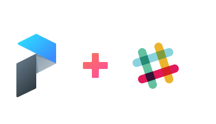

通过Prefect，可以轻松设置回调hook，以便在flow中或给定task发生某些状态更改时得到通知。这可以简单到如下：

````Python
from prefect import Flow, task
from prefect.utilities.notifications import slack_notifier


@task(name="1/x task", state_handlers=[slack_notifier])
def div(x):
    return 1 / x


@task(name="Add 1 task", state_handlers=[slack_notifier])
def add(x):
    return x + 1


with Flow('Add Divide Flow') as f:
    res = div(x=add(-1))


final_state = f.run()
````
    
它将在选择的频道中产生以下消息：


可以对其进行进一步自定义，以仅报告某些状态更改，或者可以将此工具用作更复杂的通知逻辑的构造模块！在不久的将来，将可以从通知中提供的链接直接访问UI，甚至可以从Slack内手动恢复工作流程！不过，在开始尝试之前，需要将Prefect Slack应用安装到选择的工作空间中。

## 安装说明

当前，Prefect Slack App只能使用带秘钥的安装URL进行安装。最终，可以通过在Slack App Directory中搜索它来安装它，但是今天还不可以。鉴于此，请关注共享以下URL：[安装URL](https://prefect-slack.appspot.com/)。

导航到安装URL之后，可以选择Prefect要发送消息到的工作空间和特定通道（在这里可以创建指定#prefect通道）。 例如，如果我希望通过私人消息直接向我发送通知：


做出决定后，单击绿色的“授权”按钮继续。假设一切顺利，应该会提供一个成功的登录页面，看起来像这样：


好了！将网址保存在你选择的安全位置；很快，将能够自动将其导入到Prefect Secrets数据库中。

> 
> **多次安装**
> 
> 将Prefect App多次集成到同一工作空间中是完全可以的。例如，你和同僚都使用Prefect的同事可能需要自定义的通知。 根据需要多次执行这些步骤，但是要确保跟踪每个URL关联到到哪个频道！
> 

## 使用URL获取通知

很快，你就能将Slack的webhook URL存储在安全的Prefect Secrets数据库中的SLACK_WEBHOOK_URL下，在此之前，需要将其包括在的Prefect配置文件的[context.secrets]部分中。为此，创建一个文件**~/.prefect/config.toml**并将以下内容放入其中：

````bash
[context.secrets]
SLACK_WEBHOOK_URL = "https://hooks.slack.com/services/XXXXXXXXX/xxxxxxxxx/XXXXXXXXXXX"
````

> 
> **存储秘钥**
> 
> 这种存储机密的方法仅用于本地开发和测试！
> 

几乎已完成，剩下的实际上是将**slack_notifier**状态处理器连接到喜欢的task或flow！ 所有task和flow初始化都接受一个可选的**state_handler**关键字参数。这应该包括带有调用签名的状态处理器可调用项列表。

````Python
def generic_state_handler(task_or_flow, old_state, new_state):
    # ...
    # implement your favorite custom logic to occur on state changes
    # ...
    return new_state # this is important
````

每当task（或flow）进行状态更改时，都会调用此函数。在当前示例中，**slack_notifier**已经为你设置状态处理程器！因此，正如我们在示例介绍中看到的那样，可以为所需的任何task/flow提供**slack_notifier**作为**state_handler**。

## 自定义警报

默认设置将在注册slack_notifier的task/flow的每次状态变更时发送通知。自定义Prefect Slack警报的三种简单方法：

 - 使用**ignore_states**关键字参数忽略某些状态更改
 - 使用**only_states**关键字参数仅关注某些状态更改
 - 实现定制化的状态处理器，该处理器调用**slack_notifier**

**slack_notifier**状态处理器是柯里化的，这意味着可以提前调用它来绑定某些关键字参数。例如，假设我们只想在失败状态下得到通知； 在这种情况下，可以这样做：

````Python
from prefect import task
from prefect.engine.state import Failed
from prefect.utilities.notifications import slack_notifier

handler = slack_notifier(only_states=[Failed]) # we can call it early

@task(state_handlers=[handler])
def add(x, y):
    return x + y
````
    
愉快的使用Slack吧!

***

- [Prefect官网](https://www.prefect.io/)
- [英版原文](https://docs.prefect.io/core/advanced_tutorials/slack-notifications.html)
- [联系译者](https://github.com/listen-lavender)

