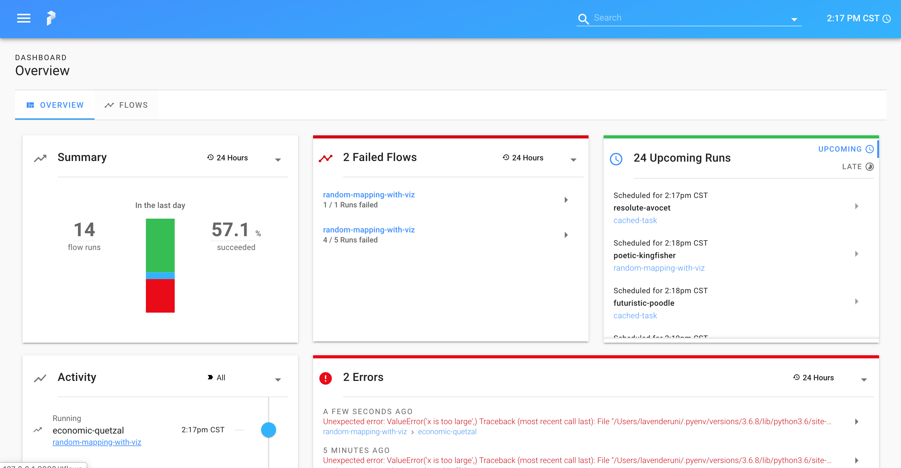
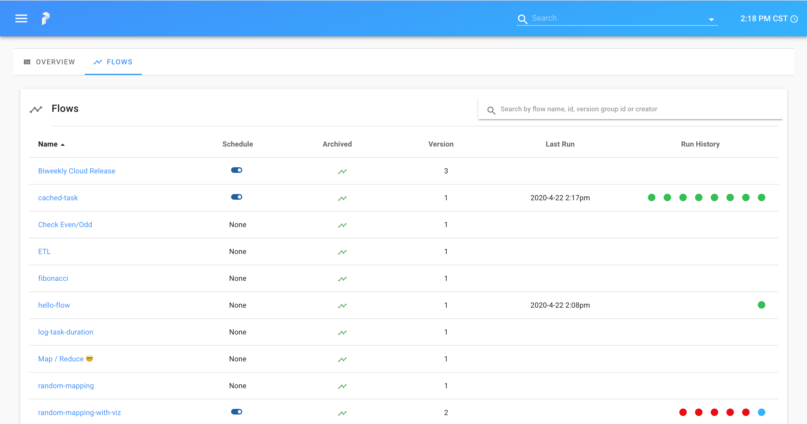

### 习惯Prefect方式思考

Prefect是一个构建工作流的工具。一个工作流是一些列确定次序执行的task。

另外，Prefect允许自定义更复杂的行为，例如一个task传递参数到其他的task，遇到问题自动重试的task，上游task失败才触发执行的task。

一旦工作流被定义了，Prefect引擎会以确保每个task的所有行为的方式执行。

这篇介绍会覆盖定义task和组合task成为工作流的基本知识点。

## Task

Prefect将工作流的最小组成单位定义为task。简单来说，task不过是一个Python函数。创建新task最简单的方式就是添加Prefect的装饰器到已存在的函数。我们来创建一个简单的task，来**print "hello, world!"**：

````Python
from prefect import task

@task
def say_hello():
    print("Hello, world!")
````

Prefect没有限制一个task能做多少事情。一般来说，相对于大型task，我们鼓励微型task，每一个task最多就执行工作流解耦后的逻辑步骤。这是因为prefict引擎处理每个task需要做很多工作，包括在每个task运行后检查状态。因此，越多的微型task，Prefect的作用越大。当然你也可以把整个工作流做成一个大型task，这样Prefect引擎对于你的业务系统就难以发挥风险管理工作。

### Task的输入和输出

Prefect tasks能支持输入和输出。在task定义中可以利用这个特性：

````Python
@task
def add(x, y=1):
    return x + y
````

我们可以将"hello, world!"函数扩展为对一个具体的人说hello：

````Python
@task
def say_hello(person: str) -> None:
    print("Hello, {}!".format(person))
````

> 
> 类型注解（Type annotations）
> 
> 注意我们如何使用Python3注释来告诉Perfict我们的输入和输出类型。
> 
> 这是完全可选的，但如果您提供类型信息，系统能对工作流做增强处理。
> 

### 面向对象风格的Task类

有时候，需要设计比单个函数更复杂的类。可以通过继承Prefect Task基类并实现**.__init__()**和**.run()**方法来设计面向对象的子类化task。下面是我们希望**add**task具有自定义默认值的示例：

````Python
from prefect import Task

class AddTask(Task):

    def __init__(self, default: int, *args, **kwargs):
        super().__init__(*args, **kwargs)
        self.default = default

    def run(self, x: int, y: int=None) -> int:
        if y is None:
            y = self.default
        return x + y

# initialize the task instance
add = AddTask(default=1)
````

注意子类化task是非常强大的，但需要编写显式代码。如上所述，我们必须初始化task示例才能使用它。当我们使用**@task**装饰器时，它返回了一个已经初始化的task对象。

请注意，子类化task更强大，但需要更明确的代码。如上所示，我们必须初始化task实例才能使用它。当我们使用**@task**时，它也是返回了一个已经初始化的task对象。

## Flow（工作流）

在Prefect中，flow用于描述task之间的依赖关系，例如它们的顺序或者如何传递数据。如果把task看作函数，那么可以将flow视为以有趣方式组合它们的脚本。

### 函数式API

构建flow的最简单方法是使用Prefect的函数式API。创建一个flow作为上下文管理器，并将task当做常规函数一样按依赖有序调用。Prefect flow将跟踪每个函数调用，并构建一个表示工作流的计算图。关键的是，此时没有实际执行任何task。

下面是一个flow，它使用我们前面编写的**add**task将几个数字相加。注意task是如何接受int数据甚至其他task作为输入；Prefict自动在工作流计算图中创建适当的连接（或者称之为“边”）。此外，请注意，我们调用add两次，在flow中生成两个不同的task运行实例：

````Python
from prefect import Flow

with Flow("My first flow!") as flow:
    first_result = add(1, y=2)
    second_result = add(x=first_result, y=100)
````

### 运行Flow

一旦flow创建了，我们通过调用**flow.run()**来运行它。在这个场景中，结束State是Success，我们还可以手工检查每个task的状态和结果：

````Python
state = flow.run()

assert state.is_successful()

first_task_state = state.result[first_result]
assert first_task_state.is_successful()
assert first_task_state.result == 3

second_task_state = state.result[second_result]
assert second_task_state.is_successful()
assert second_task_state.result == 103
````

**flow.run()**方法对于处理工作流管理的调度、重试、数据序列化等重要方面是很方便的。如果flow还附加了执行计划，调用**flow.run()** 会先睡眠直到执行计划的下一个时间点到来再开始执行flow，然后继续睡眠等待下一次执行。

> 
> 延迟执行（Deferred execution）
> 
> 在Prefect中构建flow，你是定义了一个可以在将来某个时候执行的工作流计算图，也可能是在分布式环境中。
> 
> 这就是为啥大多数文档都简单地遵循一个模式：
> 
> flow第一步需要创建（通常直接创建flow对象或者在**with Flow():**上下文中）；然后第二步执行**flow.run()**
> 
> 在生产中，不会手工调用**flow.run()**，而是让管理API唤醒执行。
> 

### 参数对象（Parameters）

有时候，在flow运行时提供参数是非常有用的。Prefect通过提供一个特殊的task来达到目的。我们使用Parameter编码一个flow实现对某人说hello的业务。

````Python
from prefect import Parameter

with Flow("Say hi!") as flow:
    name = Parameter("name")
    say_hello(name)
````
    
如果我们运行flow，我们会看到预期的很多log和print语句的输出：

````Python
flow.run(name="Marvin")

# ... [logs]
# "Hello, Marvin!"
# ... [logs]
````

### 命令式API

函数式API使得脚本风格定义工作流很容易。有时，你可能想用以更有计划性的或显式的方式构建flow。为此，我们可以使用Prefect的命令式API。

````Python
flow = Flow("My imperative flow!")

# define some new tasks
name = Parameter("name")
second_add = add.copy()

# add our tasks to the flow
flow.add_task(add)
flow.add_task(second_add)
flow.add_task(say_hello)

# create non-data dependencies so that `say_hello` waits for `second_add` to finish.
say_hello.set_upstream(second_add, flow=flow)

# create data bindings
add.bind(x=1, y=2, flow=flow)
second_add.bind(x=add, y=100, flow=flow)
say_hello.bind(person=name, flow=flow)
````

flow添加**add**task与**print "say hello"**task组合在一起，使用状态依赖（非数据依赖）指定在第二个**add**task 完成之后才运行**print "say hello"**task。

也能使用Prefect的函数式API创建状态依赖。当像调用函数一样调用task，传递task列表到一个特定关键字参数**upstream_tasks**，Prefect将自动对每个task调用**set_upstream()**。

> 
> 混合调配
> 
> 开发者可以随时在函数式API和命令式API之间切换。
> 
> 例如，在前一个代码块的中间位置，我们可以使用**with flow**，把**flow context**注入里面的函数式API中。这样至少消除了每条**bind**指令中flow=flow参数的传递。
> 
> 你可以选择你喜欢的风格。
> 

## 编排Flow

Prefect的Core Python API是一个可以描述task依赖性，甚至可以直接从的Python shell、Jupyter Notebook、长期执行脚本编排flow的功能强大的工具。但是，也可以利用现成的状态数据库和UI后端，这样能完美地编排任何Prefect流，并使可视化监控变得容易。

基于Prefect Core提供了和高可用的生产级后台产品Prefect云平台对应的开源轻量级版本。

让我们快速了解一下使用Perfict Core的服务编排flow是什么样子的，更多信息，请参阅[编排文档](https://docs.prefect.io/orchestration/)。

启动并配置Prefect Core服务后，导航到[http://localhost:8080](http://localhost:8080)以查看Perfict UI，如下图：



通过**.register()**可以在本地管理服务中注册flow，然后启动一个本地agent来支持Prefect server和flow业务代码之间的通信，然后还能在UI界面点击**Run**按钮触发flow执行，你会看到agent拉起task执行。UI会更新flow实例的状态。

agent效果如下图：


UI效果如下图：



***

- [Prefect官网](https://www.prefect.io/)
- [英版原文](https://docs.prefect.io/core/getting_started/first-steps.html)
- [联系译者](https://github.com/listen-lavender)
