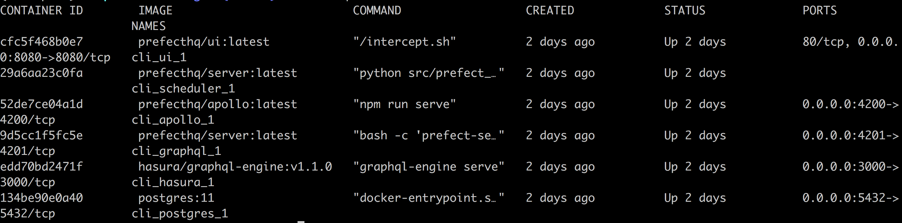

## 安装Prefect

### 基本依赖

Prefect需要Python版本3.6之上。如果你对Python不熟悉，推荐安装Anaconda发行版本。

### 安装

执行命令装Prefect

````bash
pip install prefect
````

或者你喜欢用conda

````bash
conda install -c conda-forge prefect
````

或者使用pipenv

````bash
pipenv install --pre prefect
````

### 可选依赖

Prefect使用许多使用extra开头语义的可选依赖：

````bash
pip install "prefect[extra_1, extra_2]"
````

可选依赖例子如下：

 - **all_extras**: 包括所有可选依赖
 - **dev**: 开发Prefect的工具
 - **templates**: 使用string模板工具
 - **viz**: Prefect工作流可视化工具
 - **aws**: AWS云平台交互工具
 - **google**: Goole云平台交互工具
 - **kubernetes**: Kubernetes API交互工具
 - **twitter**: Twitter API交互工具
 - **airtable**: Airtable API交互工具
 - **spacy**: 用Spacy构建NLP pipelines工具
 - **redis**: Redis数据库交互工具

### 运行本地管理后台服务和UI

除了可以对接Prefect云平台之外，Prefect还开放编排管理工作流的源代码，支持本地构建运行服务和UI。本地服务存储工作流源数据到Postgres数据库，并且暴露可操作的GraphQL API。

第一次在运行本地服务时，先执行以下命令保证之后的Prefect命令使用本地服务做拓扑关联：

````bash
prefect backend server
````

请注意本地服务依赖于[Docker](https://www.docker.com/)和[Docker Compose](https://docs.docker.com/compose/install/)工具服务在后台运行。

启动服务和UI，和所有需要的基础设施，执行以下命令：

````bash
prefect server start
````

得到如下docker container进程。



一旦所有组件启动，你可以访问[http://localhost:8080](http://localhost:8080)的UI。

还请注意要通过服务控制工作流，需要至少在本地启动一个Prefect Agent，执行以下命令：

````bash
prefect agent start
````

最后通过一行代码如下flow.register()来注册任意的工作流。更多细节参见基础设施文档。简单示例代码如下：

````python
#!/usr/bin/env python
# coding=utf8

import prefect
from prefect import task, Flow

@task
def hello_task():
    logger = prefect.context.get("logger")
    logger.info("Hello, Cloud!")

flow = Flow("hello-flow", tasks=[hello_task])
flow.register("hello-flow")
flow.run()
````

### Docker
Prefect提供源码主分支和各个发行版本的Docker镜像。

通过最新的Prefect Docker镜像来执行命令：

````bash
docker run -it prefecthq/prefect:latest
````

镜像版本表

Tag | Prefect Version | Python Version
:-: | :-: | :-:
latest | most recent PyPi version | 3.7
master | master build | 3.7
latest-python3.8 | most recent PyPi version | 3.8
latest-python3.7 | most recent PyPi version | 3.7
latest-python3.6 | most recent PyPi version | 3.6
X.Y.Z-python3.8 | X.Y.Z | 3.8
X.Y.Z-python3.7 | X.Y.Z | 3.7
X.Y.Z-python3.6 | X.Y.Z | 3.6
